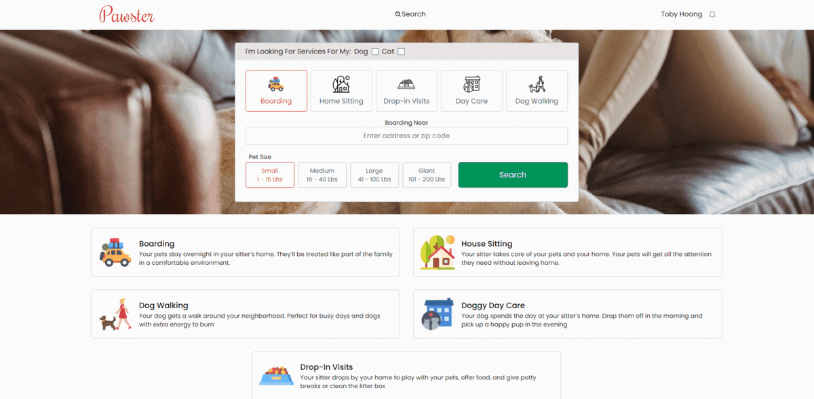

# Pawster - Crowd Sourced Pet Kenneling

* **Purpose of the app:** 

    **The Problem:** 
    - You want to go on a trip or vacation, but don't want to kennel your pet, have someone (who could be untrustworthy)
    watch them, or don't want to leave them alone for an extended period of time.
    You could leave them at your place all day while you tourist around town or you can only do tourist stuff that allows a pet.
    One solution is to bring your pet with you but then you have to deal with finding a pet friendly hotel.
 
    **How Pawster solves it**
    - Instead of stuffing your pet into a local kennel where he will be caged and get no attention, Pawster allows you to rent a 
    person who is a pet lover, and who will give your animal plenty of attention. You could select a host at one at your destinations
    so you can go visit your pet whenever you want. Alternatively you could find a host at home so the pet isn't stuck in a kennel
    or home alone with someone just stopping by to check up on your pet.

* **How to use:**
    - As Client User
        - From the landing page you may select your desired filters and search for hosts according to the filters.
        - On the search page you may apply more filters from the menu
        - Host profiles will open up upon clicking on desired host, and from the host profile, you may see their pets
        - Clicking Book a Service will take you to the checkout screen from which you may choose the desired service, and pay.
        - Clicking on the pet will open up the pet's profile page
        - Inside the profile page, on the general menu, you may add and edit your current address, and set a profile photo.
        - You may add pets, edit their information, and set a profile photo.
        - All messages will appear in the messages link inside the general menu.
    - As Host User
        - Once you are a registered host, inside the host services menu, there will be options to add and
        edit the services you would like to provide.  

* **Features on the app:**
    - Host Profile Page
    - Pet's Profile Page
    - Dashboard Features
        - Registering to become a host
            - Hosts add and edit services they would like to provide
        - Edit and add pets to user's profile
            - Pets profile can be edited and set a profile picture
        - Messaging between client and host
            - Real-time notification of new messages
    - Checkout services through Stripe
    - Google Maps and Places API Integration using MapBox
        - Maps have pins in relation to what hosts are filtered
        - Pins are clickable, displaying host information
    - Filtering hosts by services:
        - Boarding
        - Home Sitting
        - Drop-in Visits
        - Day Care
        - Dog Walking
    - Filtering hosts by options:
        - Small to giant pets
        - If their home has other pets or children
        - If the host is home full time

## Screenshots

   
## Live link: 

## Featured programs: 
HTML, CSS, Javascript, React, React-Redux, Node.js, Express, MySQL, MongoDB, GraphQL, MapBox, Stripe
## External API:
Google Maps API
## This site was built by
[Jason Paff](https://github.com/JasonPaff),
[Serghei Tolstov](https://github.com/T0lst0v),
[Toby Hoang](https://github.com/technotobes)